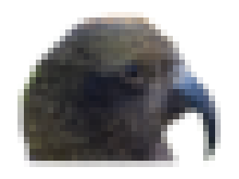

# kealib



### An HDF5 Based Raster File Format

KEALib provides an implementation of the [GDAL](https://gdal.org/) data model. 
The format supports raster attribute tables, image pyramids, meta-data 
and in-built statistics while also handling very large files and compression
 throughout.

Based on the [HDF5](https://www.hdfgroup.org/HDF5/) standard, it also provides a base from which other formats can
be derived and is a good choice for long term data archiving. An independent
software library (libkea) provides complete access to the KEA image format and
a GDAL driver allowing KEA images to be used from any GDAL supported software.

Development work on this project has been funded by 
[Landcare Research](https://www.landcareresearch.co.nz/). 

## Download
### Binaries

Once you have installed [Conda](https://conda-forge.org/), run the following commands 
on the command line to install kealib and GDAL:

```bash
conda config --add channels conda-forge
conda config --set channel_priority strict
conda create -n myenv gdal
conda activate myenv
```

Fedora and EPEL 8 (Centos etc) plugins for GDAL are available from 
[Fedora COPR](https://copr.fedorainfracloud.org/coprs/neteler/kealib/)

Packages are also avaible for SUSE and Alpine Linux.

### Source

KEALib requires: [HDF5](https://www.hdfgroup.org/HDF5/) with the C++ libraries and headers. 
[GDAL](https://gdal.org/) is required to build the GDAL driver.
Download releases through Git at [GitHub](https://github.com/ubarsc/kealib)

## Documentation

C++ documentation is available [here](cpp/html/index.html) and documentation of the Python 
interface is documented [here](docs/python/kealib.html).

Some documentation on compilation is available in the 
[KEALib wiki](https://github.com/ubarsc/kealib/wiki).

Documentation on the GDAL data model and API is available from the 
[GDAL](https://gdal.org/) website.

There is also a [paper](http://dx.doi.org/10.1016/j.cageo.2013.03.025) describing the 
features of the format.
